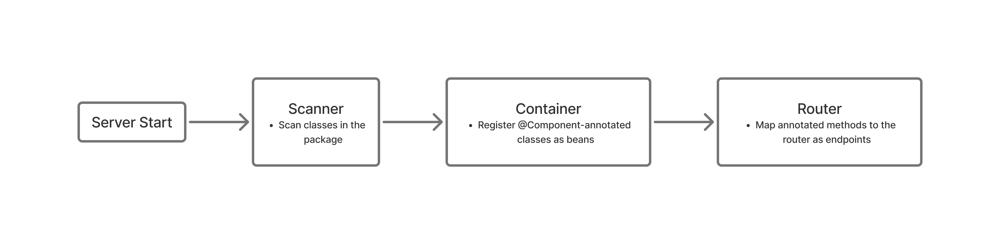
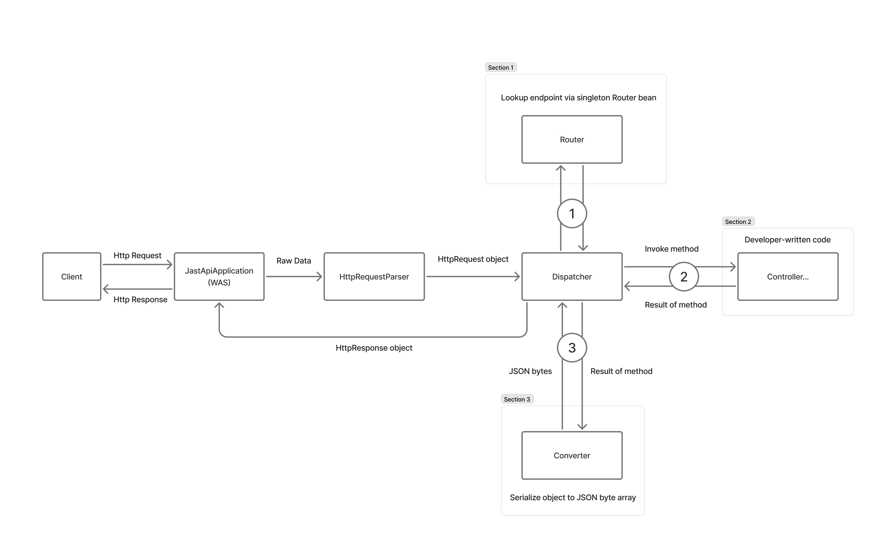

# JastAPI

[[English]](./README.md) | [한국어]

## 프로젝트 제목
**백엔드 프레임워크 `JastAPI`**

## 개발 버전과 의존성
- **Java**: `21`
- **Build Tool**: `Gradle 9.4.0`
- **Dependencies**: `Jackson Databind 2.21.2`

## 1. 프로젝트 개요

`JastAPI`는 Java에서 FastAPI처럼 쉽고 직관적으로 백엔드 서버를 구축할 수 있게 하는 백엔드 프레임워크입니다.
Spring Boot로부터 많은 영향을 받았습니다.
복잡한 외부 설정 없이 단 한 줄의 코드로 서버를 구동할 수 있도록 자체 WAS를 내장하고 있습니다.

> 이 저장소에는 원래 `JastAPI`를 활용한 게시판 CRUD 데모 앱(`jastapi_example`)도 함께 포함되어 있었습니다.
> 이 저장소를 독립적인 프레임워크로 배포하기 위해 해당 예제는 삭제되었습니다.

## 2. JastAPI (백엔드 프레임워크)
Spring Boot의 동작 방식에서 영감을 받아 구현되었으며,
리플렉션을 기반으로 한 자동 클래스 스캔과 의존성 주입(DI)을 지원합니다.

### 2.1 주요 기능 및 특징

- **자체 WAS 내장**: `ServerSocket`을 활용해 구현된 내장 WAS를 통해 외부 설정 없이
`JastApiApplication.run()`메서드 호출만으로 서버가 실행됩니다.
- **자동 클래스 스캔 및 DI 컨테이너**: 서버 구동시 자동으로 특정 패키지의 하위에 존재하는 클래스들을
스캔해서 `@Component` 어노테이션이 붙은 클래스들을 싱글톤 빈(Bean)으로 컨테이너에 자동으로 등록하고,
필요한 의존성을 주입합니다.
- **어노테이션 기반 라우팅**: `@Get`, `@Post`, `@Patch`, `@Delete` 어노테이션을 통해 HTTP 메서드에 맞춘
직관적인 라우팅을 지원합니다. 또한 `@RequestBody`, `@RequestParam`, `@PathVariable` 어노테이션을 통해
HTTP응답에서 적절한 값을 파싱할 수 있습니다.
- **자동 데이터 변환**: `Jackson Databind`를 활용하여 클라이언트로부터 들어오는 JSON 요청을 Java 객체로, Java 객체를 JSON 응답으로 자동으로
직렬화 / 역직렬화합니다.

### 2.2 내부 구조

> 서버 시작 시 패키지 스캔 및 빈 등록 과정입니다.


> 요청이 들어왔을 때의 처리 흐름입니다.


## 3. JastAPI 백엔드 프레임워크 사용 가이드
`JastAPI`는 직관적인 어노테이션을 통해 간편하게 서버를 구현 할 수 있게 하는걸 목표로 개발되었습니다.
또한, 본 백엔드 프레임워크는 Spring Boot에서 많은 영향을 받았기 때문에 대부분의 사용
방법이 유사합니다.

### 3.1 설치
`JastAPI`는 [JitPack](https://jitpack.io/#ggm77/JastAPI)을 통해 배포됩니다.

JitPack 저장소를 추가합니다. 최근 Gradle/IntelliJ 버전으로 생성한 프로젝트처럼 `settings.gradle`에 `dependencyResolutionManagement`를 사용 중이라면 거기에 추가하세요.
```gradle
// settings.gradle
dependencyResolutionManagement {
    repositories {
        mavenCentral()
        maven { url 'https://jitpack.io' }
    }
}
```
그렇지 않다면 `build.gradle`의 `repositories` 블록에 추가하면 됩니다.

이후 `build.gradle`에 의존성을 추가합니다.
```gradle
dependencies {
    implementation 'com.github.ggm77:JastAPI:v1.0.0'
}
```
`Jackson Databind`는 전이 의존성(transitive dependency)으로 함께 포함되므로 별도로 추가할 필요가 없습니다.

### 3.2 기본 서버 동작
`JastAPI`는 자체 WAS를 이용하므로 아래 코드를 통해 즉시 서버를 실행 시킬 수 있습니다.
```java
import com.seohamin.jastapi.JastApiApplication;

public class Main {
    public static void main(String[] args) {
        // 첫 번째 인자: 패키지 스캔의 기준이 되는 클래스 - 이 클래스가 포함된 패키지의 하위에 존재하는 클래스들을 스캔합니다.
        // 두 번째 인자: 로컬호스트(127.0.0.1) 전용 바인딩 여부 (false면 0.0.0.0)
        // 세 번째 인자: 사용할 포트 번호
        JastApiApplication.run(Main.class, false, 8080);
    }
}
```

### 3.3 의존성 주입 (DI)
`JastAPI`는 서버 구동시 프로젝트를 스캔하며 `@Component` 어노테이션이 달린 클래스를 찾아,
싱글톤 빈(Bean)으로 관리합니다. 생성자를 통해 필요한 객체를 자동으로 주입 받을 수 있습니다.
**단, 의존성 주입을 받을 클래스는 단 하나의 생성자만 가지고 있어야 합니다.**
```java
import com.seohamin.jastapi.annotation.core.Component;

@Component
public class PostService {
    
    // 주입 받은 객체를 저장할 필드
    private final PostRepository postRepository;
    
    // 생성자를 통한 DI
    public PostService(PostRepository postRepository) {
        this.postRepository = postRepository;
    }
    
    // 예시
    public void printPost(Long id) {
        // 주입받은 객체의 메서드를 바로 사용가능
        System.out.println(postRepository.findById(id));
    }
}
```

`JastAPI`에서도 인터페이스를 정의하고, 해당 인터페이스만 주입 받아 어떤 구현체를 사용하는지 숨길 수 있습니다.
단, 구현체가 여러개일 경우 어떤 구현체를 주입해야 할지 정하지 못하기 때문에, 현재는 인터페이스당 하나의 구현체만 존재할 수 있습니다.

```java
// MariaDbConnectionProvider.java

import com.seohamin.jastapi.annotation.core.Component;
import com.seohamin.jastapi.db.ConnectionProvider;

import java.sql.Connection;

@Component
public class MariaDbConnectionProvider implements ConnectionProvider {
    @Override
    public Connection getConnection() {
        // 생략..
    }

    @Override
    public void releaseConnection(Connection connection) {
        // 생략..
    }
}

// PostRepository.java
import com.seohamin.jastapi.annotation.core.Component;
import com.seohamin.jastapi.db.ConnectionProvider;

import java.sql.Connection;

@Component
public class PostRepository {

    // 객체 주입받을 필드
    private final ConnectionProvider connection;

    // 생성자를 통해 DI
    public PostRepository(ConnectionProvider connectionProvider) {
        this.connection = connectionProvider;
    }

    // MariaDbConnectionProvider에서 오버라이딩한 메서드를 자동으로 사용
    private Connection getConnection() {
        return connection.getConnection();
    }
}
```


### 3.4 라우팅 설정
`@Component`를 통해 빈으로 등록된 클래스 내부에서,
HTTP 메서드에 맞는 어노테이션(`@Get`, `@Post`, `@Patch`, `@Delete`)을 사용하여 라우팅을 설정합니다.

```java
@Get("/api/post/{id}")
public PostResponse getPost(
        @PathVariable("id") String id
) {
    return postService.getPost(id);
}
```

### 3.5 클라이언트 요청 파싱
`@PathVariable`, `@RequestParam`, `@RequestBody` 어노테이션을 통해서
클라이언트가 전송하는 요청을 자동으로 파싱할 수 있습니다.
- **`@PathVariable`**: URL 경로에 포함된 동적 값을 추출합니다. (동시에 여러개 사용가능)
- **`@RequestParam`**: URL의 쿼리 스트링(Query String) 값을 추출합니다.
- **`@RequestBody`**: HTTP Body로 들어오는 JSON 데이터를 자바 객체로 역직렬화합니다.

```java
@Patch("/api/post/{id}/content/{contentId}")
public PostResponse updatePost(
        @PathVariable(value="id") String id, // 어노테이션의 value는 꼭 엔드포인트에 적힌 값과 같아야 함.
        @PathVariable(value="contentId") String contentId, // PathVariable은 String으로만 받을 수 있음.
        @RequestParam(value="query") List<String> query, // RequestParam은 List<String>으로만 받을 수 있음.
        @RequestBody PostRequest postRequest // HTTP request body를 PostRequest에 담아서 줌
) {
    return postService.updatePost(id, postRequest);
}
```

### 3.6 HttpRequest & HttpResponse
컨트롤러에서 `HttpRequest`를 매개변수로 가진 경우, 자동으로 클라이언트에게 받은 요청을 그대로 전달합니다.
컨트롤러에서 리턴 타입이 `HttpResponse`인 경우, 개발자가 리턴한 `HttpResponse`를 다른 추가 가공 없이 그대로 리턴합니다.

```java
@Get("/")
public HttpResponse getHomePage(HttpRequest httpRequest) {
    byte[] body = httpRequest.getBody();
    
    // Build HttpResponse's http header.
    final HttpHeader responseHeader = new HttpHeader();
    responseHeader.add("Content-Type", "text/html; charset=utf-8");
    responseHeader.add("Content-Length", String.valueOf(body.length));
    responseHeader.add("Connection", "keep-alive");
    responseHeader.add("Cache-Control", "no-cache, no-store, must-revalidate");
    responseHeader.add("Date", HttpTime.getCurrentTime());

    // Build HttpResponse with body and http header.
    final HttpResponse httpResponse = new HttpResponse();
    httpResponse.setStatusCode(HttpStatus.OK.getStatusCode());
    httpResponse.setStatusMessage(HttpStatus.OK.getStatusMessage());
    httpResponse.setVersion("HTTP/1.1");
    httpResponse.setBody(body);
    httpResponse.setHeader(responseHeader);

    // return HttpResponse directly.
    return httpResponse;
}
```

### 3.7 직렬화와 역직렬화
컨트롤러의 리턴 타입이 일반 자바 객체이거나, `@RequestBody`가 정의된 변수의 타입이 일반 자바 객체인 경우,
각각 자동으로 직렬화, 역직렬화를 진행합니다.
이때 `Jackson Databind`를 통해서 변환 되기 때문에, 꼭 기본 생성자와 각 필드에 대한 게터가 존재해야합니다.
```java
public class PostRequest {
    // 필드
    private String title;
    private String content;
    private String author;
    private String password;

    // 직렬화를 위한 기본 생성자
    public PostRequest() {}

    // 직렬화를 위한 게터
    public String getTitle() { return title; }
    public String getContent() { return content; }
    public String getAuthor() { return author; }
    public String getPassword() { return password; }

}
```

### 3.8 예외 처리
`HttpResponseException` 클래스를 이용하면, 비즈니스 로직에서 바로 400번대나 500번대 HTTP 응답코드를 가진 응답을 전송시킬 수 있습니다.
이외에 일반 예외 (NPE 등)이 발생하면 디스패쳐에서 500 INTERNAL_SERVER_ERROR로 래핑되어서 응답합니다.

```java
throw new HttpResponseException(ErrorResponse.createBadRequest("HTTP/1.1"));
```

## 4. UML 다이어그램

> 
> 점선: 의존관계
>
> 실선: 연관관계
> 
> 초록 블럭: 컨테이너가 관리하는 빈(Bean) (@Component를 통해 DI 됨)
>
> 흰색 블럭: 일반 자바 객체
