# JastAPI

[English] | [[한국어]](./README.ko.md)

_*Note: The Korean version is the original document and may offer the most natural phrasing._

## Project Title
**Backend Framework `JastAPI` and Board CRUD App**

## Team Members
| Name                    | Student ID       | Role                                  |
|:----------------------|:---------|:------------------------------------|
| Hamin SEO (서하민)       | 22300378 | Backend framework development, Board CRUD app architecture design and implementation |
| Donghyeon SON (손동현)   | 22300385 | Board CRUD app implementation                       |

## Development Version and Dependencies
- **Java**: `21`
- **Build Tool**: `Gradle 9.4.0`
- **Dependencies**: `Jackson Databind 2.21.2`

## 1. Project Overview

`JastAPI` is a backend framework that allows you to build backend servers in Java as easily and intuitively as FastAPI.
It is heavily inspired by Spring Boot.
It features a built-in WAS, enabling you to run the server with just a single line of code without complex external configurations.

This project is mainly composed of two parts: the framework core, `JastAPI`, and a demo application utilizing it, `jastapi_example`.

## 2. JastAPI (Backend Framework)
Implemented with inspiration from Spring Boot's operating mechanism,
it supports automatic class scanning and Dependency Injection (DI) based on reflection.

### 2.1 Key Features and Characteristics

- **Built-in WAS**: Through a built-in WAS implemented using `ServerSocket`,
the server runs simply by calling the `JastApiApplication.run()` method without any external configuration.
- **Automatic Class Scanning and DI Container**: When the server starts,
it automatically scans classes under a specific package,
registers classes with the `@Component` annotation as singleton Beans in the container,
and injects the necessary dependencies.
- **Annotation-based Routing**: Supports intuitive routing tailored to HTTP methods through
`@Get`, `@Post`, `@Patch`, and `@Delete` annotations.
Additionally, it can parse appropriate values from HTTP requests via
`@RequestBody`, `@RequestParam`, and `@PathVariable` annotations.
- **Automatic Data Conversion**: Utilizes `Jackson Databind` to automatically
serialize and deserialize incoming JSON requests from the client into Java objects, and Java objects into JSON responses.

### 2.2 Internal Structure

> Package scanning and bean registration process during server startup.
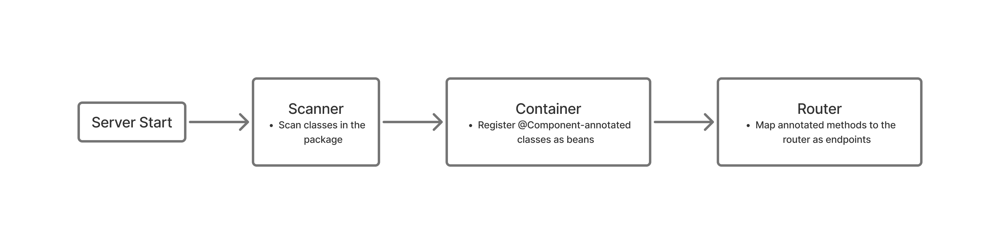

> Processing flow when a request is received.
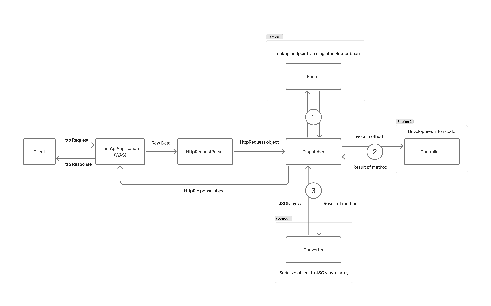

## 3. Board CRUD App
This is a sample project demonstrating how the `JastAPI` framework can actually be utilized.
It implements basic post creation, reading, updating, and deletion (CRUD) features.
It also persists data by integrating with a DB.

### 3.1 Key Components

- **Main.java**: The entry point of the application,
running the server through the `JastApiApplication.run()` method.
- **HomeController.java**: Serves the index.html file, which acts as the frontend when accessing the root path (`/`).
- **PostController.java**: Provides the `/api/post` endpoint, receives HTTP requests, and passes them to the service layer.
- **PostService.java**: Generates responses according to various logic based on the HTTP request information passed down from the controller.
- **MariaDbConnectionProvider.java & PostRepository.java**: Responsible for database connection and manipulating actual data.

## 4. JastAPI Backend Framework Usage Guide
`JastAPI` was developed with the goal of allowing developers to easily implement a server through intuitive annotations.
Additionally, since this backend framework is heavily inspired by Spring Boot, most of its usage is quite similar.

### 4.1 Prerequisites
All classes of this framework are located under `src/main/java/com/seohamin/jastapi`.
Therefore, it is recommended to copy the entire `com` package under the `java` folder,
place it in an appropriate location in your project, and then delete the `jastapi_example` package,
which is an example project existing under the `com.seohamin` package.

Furthermore, this framework requires `Jackson Databind 2.21.2`. It must be added to your project's dependencies.

### Basic Server Operation
`JastAPI` uses its own WAS, so you can immediately run the server using the code below.
```java
import com.seohamin.jastapi.JastApiApplication;

public class Main {
    public static void main(String[] args) {
        // First argument: The base class for package scanning - It scans the classes located under the package that contains this class.
        // Second argument: Whether to bind exclusively to localhost (127.0.0.1) (If false, binds to 0.0.0.0).
        // Third argument: The port number to use.
        JastApiApplication.run(Main.class, false, 8080);
    }
}
```

### 4.3 Dependency Injection (DI)
`JastAPI` scans the project upon server startup, finds classes annotated with
`@Component`, and manages them as Singleton Beans. You can automatically receive necessary objects via constructor injection.
**However, the class receiving dependency injection must have only one constructor.**
```java
import com.seohamin.jastapi.annotation.core.Component;

@Component
public class PostService {

    // Field to store the injected object
    private final PostRepository postRepository;

    // DI via constructor
    public PostService(PostRepository postRepository) {
        this.postRepository = postRepository;
    }

    // Example
    public void printPost(Long id) {
        // Can directly use the methods of the injected object
        System.out.println(postRepository.findById(id));
    }
}
```

In `JastAPI`, you can also define an interface and inject only that interface to hide which implementation is being used.
However, since the framework currently cannot determine which implementation to inject if there are multiple,
there can only be one implementation per interface at this time.

```java
// MariaDbConnectionProvider.java

import com.seohamin.jastapi.annotation.core.Component;
import com.seohamin.jastapi.db.ConnectionProvider;

import java.sql.Connection;

@Component
public class MariaDbConnectionProvider implements ConnectionProvider {
    @Override
    public Connection getConnection() {
        // omitted..
    }

    @Override
    public void releaseConnection(Connection connection) {
        // omitted..
    }
}

// PostRepository.java
import com.seohamin.jastapi.annotation.core.Component;
import com.seohamin.jastapi.db.ConnectionProvider;

import java.sql.Connection;

@Component
public class PostRepository {

    // Field to receive the injected object
    private final ConnectionProvider connection;

    // DI via constructor
    public PostRepository(ConnectionProvider connectionProvider) {
        this.connection = connectionProvider;
    }

    // Automatically uses the overridden method from MariaDbConnectionProvider
    private Connection getConnection() {
        return connection.getConnection();
    }
}
```


### 4.4 Routing Configuration
Inside a class registered as a bean via `@Component`,
you can configure routing using annotations corresponding to HTTP methods (`@Get`, `@Post`, `@Patch`, `@Delete`).

```java
@Get("/api/post/{id}")
public PostResponse getPost(
        @PathVariable("id") String id
) {
    return postService.getPost(id);
}
```

### 4.5 Parsing Client Requests
You can automatically parse requests sent by the client using the
`@PathVariable`, `@RequestParam`, and `@RequestBody` annotations.
- **`@PathVariable`**: Extracts dynamic values included in the URL path. (Multiple can be used simultaneously).
- **`@RequestParam`**: Extracts values from the URL's Query String.
- **`@RequestBody`**: Deserializes JSON data coming into the HTTP Body into a Java object.

```java
@Patch("/api/post/{id}/content/{contentId}")
public PostResponse updatePost(
        @PathVariable(value="id") String id, // The value of the annotation must be exactly the same as the endpoint value.
        @PathVariable(value="contentId") String contentId, // PathVariable can only be received as a String.
        @RequestParam(value="query") List<String> query, // RequestParam can only be received as a List<String>.
        @RequestBody PostRequest postRequest // Puts the HTTP request body into PostRequest.
) {
    return postService.updatePost(id, postRequest);
}
```

### 4.6 HttpRequest & HttpResponse
If a controller takes `HttpRequest` as a parameter, it automatically passes the exact request received from the client.
If the controller's return type is `HttpResponse`, it directly returns the `HttpResponse` returned by the developer without any further processing.

```java
@Get("/")
public HttpResponse getHomePage(HttpRequest httpRequest) {
    byte[] body = httpRequest.getBody();
    
    // Build HttpResponse's http header.
    final HttpHeader responseHeader = new HttpHeader();
    responseHeader.add("Content-Type", "text/html; charset=utf-8");
    responseHeader.add("Content-Length", String.valueOf(body.length));
    responseHeader.add("Connection", "keep-alive");
    responseHeader.add("Cache-Control", "no-cache, no-store, must-revalidate");
    responseHeader.add("Date", HttpTime.getCurrentTime());

    // Build HttpResponse with body and http header.
    final HttpResponse httpResponse = new HttpResponse();
    httpResponse.setStatusCode(HttpStatus.OK.getStatusCode());
    httpResponse.setStatusMessage(HttpStatus.OK.getStatusMessage());
    httpResponse.setVersion("HTTP/1.1");
    httpResponse.setBody(body);
    httpResponse.setHeader(responseHeader);

    // return HttpResponse directly.
    return httpResponse;
}
```

### 4.7 Serialization and Deserialization
If the controller's return type is a standard Java object, or if the type of a variable defined with
`@RequestBody` is a standard Java object, it automatically performs serialization and deserialization, respectively.
Since this conversion is handled by `Jackson Databind`, a default constructor and getters for each field must be present.
```java
public class PostRequest {
    // Fields
    private String title;
    private String content;
    private String author;
    private String password;

    // Default constructor for serialization
    public PostRequest() {}

    // Getters for serialization
    public String getTitle() { return title; }
    public String getContent() { return content; }
    public String getAuthor() { return author; }
    public String getPassword() { return password; }

}
```

### 4.8 Exception Handling
By using the `HttpResponseException` class, you can instantly send a response with a 400-level or 500-level HTTP status code directly from your business logic.
In addition, if a general exception (e.g., NPE) occurs, it is wrapped by the Dispatcher and returned as a 500 INTERNAL_SERVER_ERROR response.

```java
throw new HttpResponseException(ErrorResponse.createBadRequest("HTTP/1.1"));
```

## 5. Board CRUD App Execution Guide

The following guide is for running the Board CRUD project, an example project of `JastAPI`.
If you want to use it simply, you can access the deployed project via the link below.

> <a href="https://jastapi.seohamin.com/">https://jastapi.seohamin.com/</a>
>
> *In this project, passwords are saved as plaintext. Never enter a real password.

### 5.1 Prerequisites

- **Java**: JDK 21
- **Database**: MariaDB
> If you are using a JDK version higher than 21, you can use it normally by replacing the `JavaLanguageVersion.of(21)` part in `build.gradle` with `JavaLanguageVersion.of(your_version)`.

> Even if you do not install MariaDB, the server will operate up to serving `index.html` when started.

### 5.2 Database Configuration

Before running the application, MariaDB must be running locally.
You need to create a database user according to the connection information below,
or appropriately modify the connecting user's information in `MariaDbConnectionProvider.java`.

- **URL**: `jdbc:mariadb://localhost:3306/jastapi_example`
- **User ID**: `jastapi`
- **User Password**: `1234`

Access the database to create the `jastapi_example` schema according to the settings above, and create the `post` table to run the example.
You can create it using the code below.
```sql
CREATE TABLE post(
    id BIGINT NOT NULL AUTO_INCREMENT,
    title VARCHAR(100) NOT NULL,
    content VARCHAR(255) NOT NULL,
    author VARCHAR(100) NOT NULL,
    password VARCHAR(100) NOT NULL,
    PRIMARY KEY (id)
);
```

### 5.3 How to Run the Server
> 1. Run the following command in the root directory of the project (the folder containing the README.md file).
> 
> `./gradlew build`


> 2. Navigate to the location of the generated JAR file using the command below.
> 
> `cd build/libs`

> 3. Run the server using the command below. (You can terminate it with `^C` or `Ctrl + C`.)
> 
> `java -jar JastAPI-1.0.0.jar`

> 4. If the message `[INFO] Server started on port 8080...` is printed in the console, the server has started successfully.
> 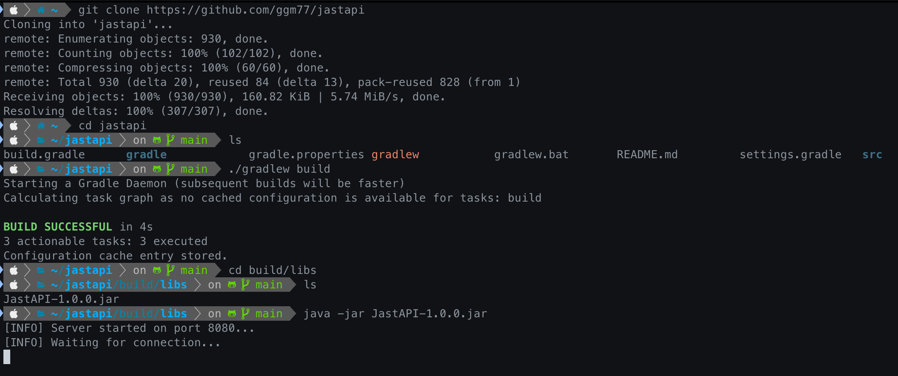

### 5.4 Service Access and Usage

> 1. Open a web browser and enter `http://localhost:8080` in the address bar.

> 2. You can register, view, edit, or delete posts through the UI displayed on the screen.
> 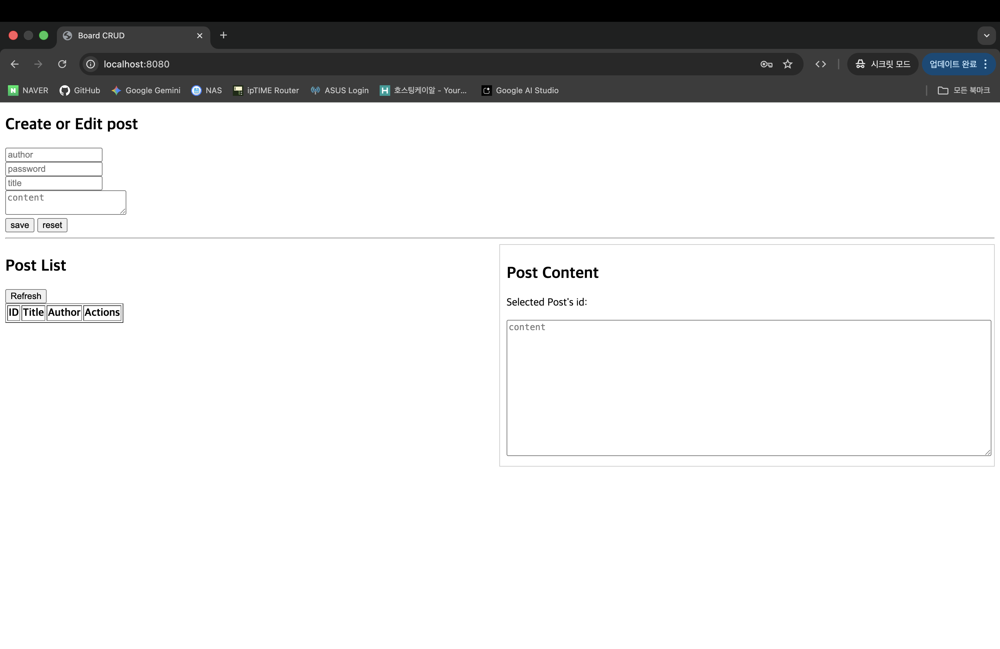

### _**In this project, passwords are stored in plaintext. Never enter a real password.**_

> 3. As shown in the image below, enter the post title, author, password, and content, then click the `save` button to save it.
> 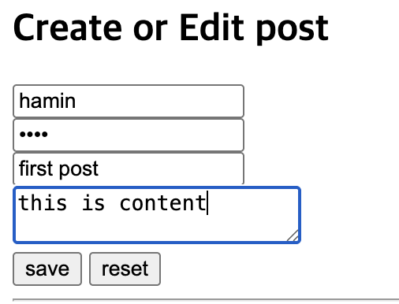
> 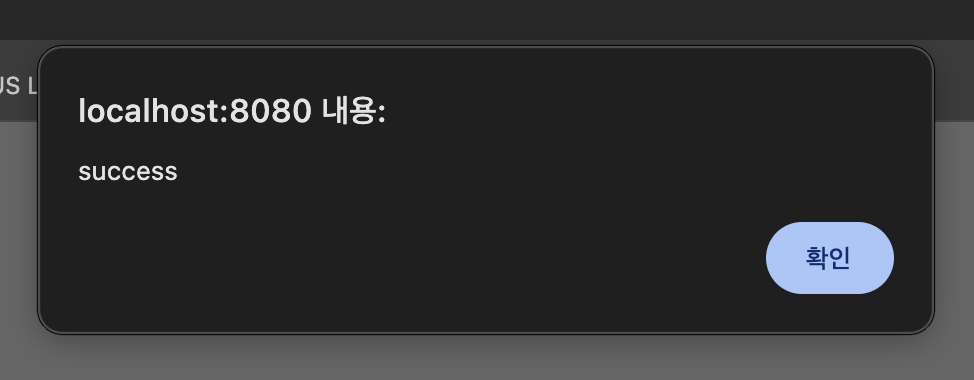

> 4. You can check the changes in the list below, and click on the title to view the content.
> 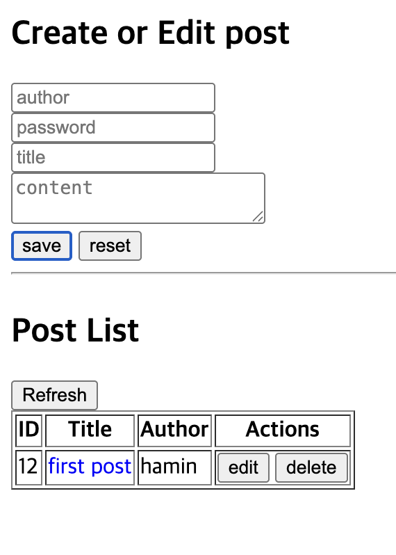
> 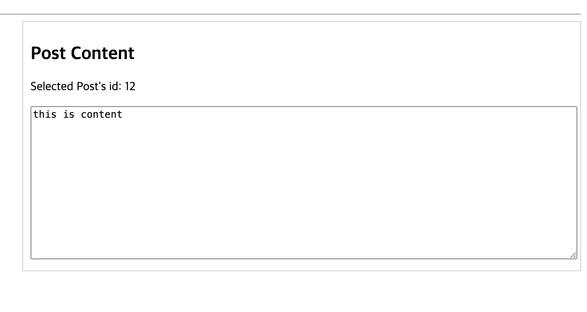

> 5. Clicking the `edit` button in the post list loads the current post content. You can modify it by making appropriate changes and entering the correct password.
> 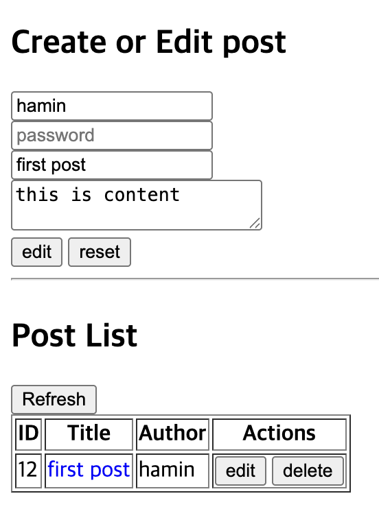
> 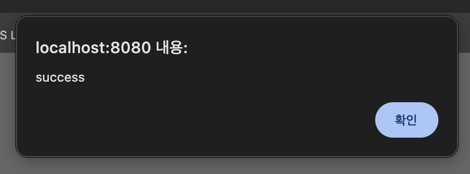

> 6. You can delete a post by clicking the `delete` button in the post list and entering the correct password.
> 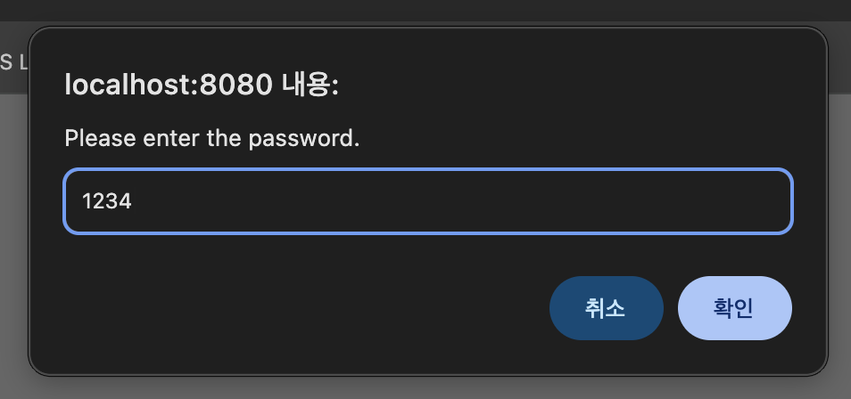
> 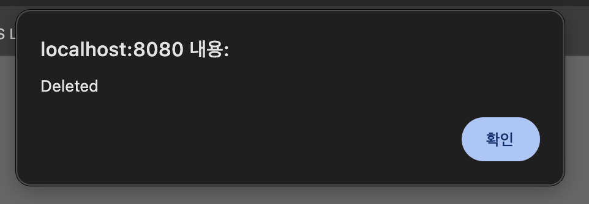

> 7. If an invalid value is entered during post registration, modification, or deletion, a 400 error occurs.
> 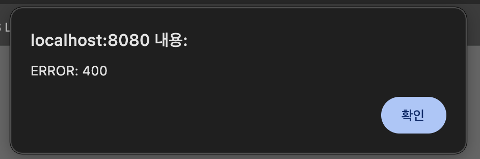

## 6. UML Diagrams

> 

> 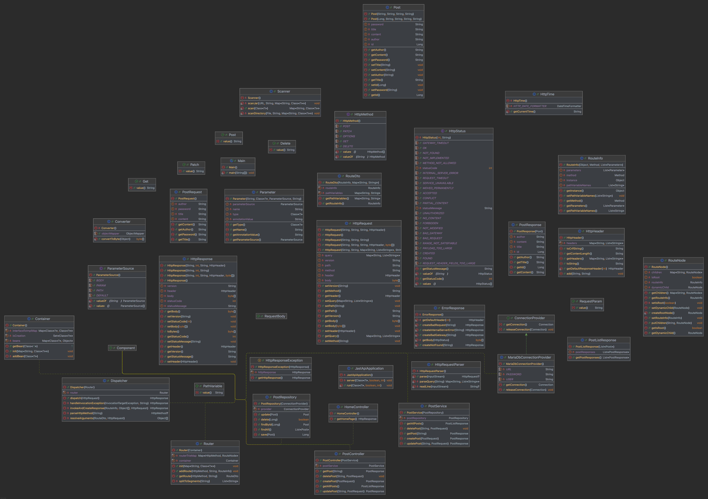
> Click the image to view it in full size.
